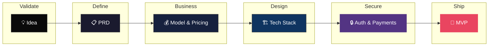

<p align="center">
  
</p>

<h3 align="center">From idea to production SaaS — with Claude doing the heavy lifting.</h3>

<p align="center">
  <strong>A structured, prompt-driven workflow for solo founders to design, validate, and ship secure SaaS products.</strong>
</p>

<p align="center">
  <a href="LICENSE"></a>
  <a href="http://makeapullrequest.com"></a>
  
  
</p>

---

## What this is

**Claude-SaaS-Builder** is a collection of structured prompt scripts designed to walk Claude through every critical decision a solo founder needs to make before writing a single line of code.

Each script is a **conversation starter** — you paste it into Claude, answer its questions, and get back a production-ready document (PRD, pricing model, tech design, security checklist, etc.) that feeds directly into the next step.

This is **not** a generic AI coding template. Every prompt is written specifically for SaaS: recurring revenue, churn, auth flows, billing edge cases, compliance concerns, and infrastructure that scales without you managing it.

---

## Who this is for

Solo founders and indie hackers who:

- Have a SaaS idea and want to move fast without cutting dangerous corners
- Are technical enough to ship but short on time to research every decision
- Want AI assistance that produces **real, opinionated output** — not vague advice
- Care about building something secure and sustainable from day one

---

## Workflow overview

```
Idea → Validation → PRD → Business Model → Tech Stack → Auth & Payments → Build
```

Each phase produces a document. Each document feeds the next prompt. By the end you have a complete project brief Claude can use to help you build — with no ambiguity, no hallucinated scope, and no forgotten security surface.



---

## The 6 steps

### Step 1 — Idea Validation & Market Fit

**File:** `part1-saas-validation.md` · **Time:** 20–30 min

Paste the prompt into Claude (with web search on if available). Answer its questions about your idea. You'll get back:

- A realistic market size estimate
- Top 3–5 competitors with honest gap analysis
- A go/no-go recommendation with reasoning
- A one-liner value proposition you can test immediately

Save the output as `research-[YourSaaS].md`.

---

### Step 2 — Product Requirements (PRD)

**File:** `part2-saas-prd.md` · **Time:** 15–20 min

Paste `part2-saas-prd.md` into the same chat, or a new one with your research attached. Claude will produce a SaaS-specific PRD covering:

- Core feature set (MVP scope, nothing more)
- User roles and permission model
- Key user journeys (signup → activation → upgrade → churn)
- Explicit out-of-scope items to protect your timeline

Save as `PRD-[YourSaaS]-MVP.md`.

---

### Step 3 — Business Model & Pricing Strategy

**File:** `part3-business-model.md` · **Time:** 20–25 min

This prompt is unique to this workflow. Claude will help you define:

- Pricing model (flat rate, per-seat, usage-based, freemium)
- Tier structure with feature gates
- MRR targets and unit economics for your first 100 customers
- Churn risk triggers and retention levers to build in from the start

Save as `BusinessModel-[YourSaaS].md`.

---

### Step 4 — Technical Stack Design

**File:** `part4-tech-design.md` · **Time:** 15–20 min

Claude asks about your solo-founder constraints (budget, runway, existing skills) and recommends a stack with explicit rationale. Output covers:

- Frontend, backend, and database choices
- Hosting and deployment strategy (with cost estimates)
- Third-party services vs. build-yourself tradeoffs
- A scalability ceiling so you know when you'll need to revisit

Save as `TechDesign-[YourSaaS].md`.

---

### Step 5 — Auth, Payments & Security Checklist

**File:** `part5-auth-payments-security.md` · **Time:** 20–30 min

The step most templates skip. Claude walks through:

- Auth implementation (provider choice, session strategy, MFA)
- Billing integration (Stripe setup, webhook handling, failed payment flows)
- GDPR / data privacy baseline
- OWASP Top 10 applied to your specific stack
- Pre-launch security checklist you can tick off yourself

Save as `Security-[YourSaaS].md`.

---

### Step 6 — Build with Claude

**File:** `part6-agent-setup.md` · **Time:** 1–3 hrs

Move into your IDE (Cursor, VS Code + Copilot, Claude Code). The setup prompt reads all your saved documents and generates:

- `AGENTS.md` — master instructions for your coding agent
- `agent_docs/` — stack-specific rules, testing standards, coding conventions
- Phase 1 build plan for your approval before anything is written

From there, build in small approved loops:

```
Plan (approve) → Execute (one feature) → Verify (test + review) → repeat
```

---

## Project structure

```
your-saas/
├── 📁 docs/
│   ├── research-[YourSaaS].md
│   ├── PRD-[YourSaaS]-MVP.md
│   ├── BusinessModel-[YourSaaS].md
│   ├── TechDesign-[YourSaaS].md
│   └── Security-[YourSaaS].md
├── 📄 AGENTS.md                   # Master agent contract
├── 📁 agent_docs/
│   ├── tech_stack.md
│   ├── security_rules.md
│   ├── billing_conventions.md
│   └── testing.md
├── 📁 specs/                      # Per-feature handoff files
└── 📁 src/                        # Your application code
```

---

## What makes this different

| Feature | vibe-coding-prompt-template | Claude-SaaS-Builder |
|---|---|---|
| Target use case | Any MVP | SaaS products specifically |
| Business model step | ❌ | ✅ Pricing, MRR, churn |
| Auth & billing guidance | ❌ | ✅ Stripe, sessions, webhooks |
| Security checklist | ❌ | ✅ OWASP + GDPR baseline |
| Prompt specificity | General | SaaS-opinionated |

---

## Tools this workflow is designed for

| Phase | Recommended |
|---|---|
| Steps 1–5 (research & planning) | Claude.ai (with web search enabled) |
| Step 6 (build) | Cursor, Claude Code, VS Code + Copilot |
| Deployment | Vercel (frontend), Railway / Render (backend) |
| Payments | Stripe |
| Auth | Clerk, Auth.js, or Supabase Auth |

---

## Important limits

This workflow will not help you with:

- Native mobile apps (iOS/Android)
- Regulated industries (fintech, healthtech, legal) beyond the baseline security step
- Enterprise sales motions or B2B compliance (SOC 2, HIPAA)

For those cases, the prompts give you a solid foundation but you'll need specialist input.

---

## Common mistakes to avoid

| Mistake | Fix |
|---|---|
| Skipping the business model step | Pricing decisions affect your data model. Do it before you build. |
| Ignoring the security checklist | One leaked env variable or missing rate limit kills trust on day one. |
| Letting the agent define scope | You define scope in the PRD. The agent executes. Never the other way around. |
| Building auth from scratch | Use a provider. Spend your hours on what makes your SaaS unique. |

---

## Contributing

PRs and issues are welcome. If you use this workflow to ship a SaaS, open an issue and share what worked or what needed changing — it improves the prompts for everyone.

See [CONTRIBUTING.md](.github/CONTRIBUTING.md) for guidelines.

---

## License

Released under the [MIT License](LICENSE).

---

<p align="center">
  <strong>Stop building without a plan. Paste a prompt, answer the questions, ship with confidence.</strong>
</p>
